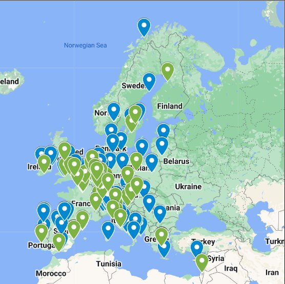

# Collaboration Exchange Fund

View an online rendered version of the html files at https://TAILOR-UoB.github.io/collaboration-exchange-fund/

This is a static html version of the content intended to be added into the
[TAILOR website](https://tailor-network.eu/). It can be visualised locally by
opening the index.html file with your web browser.

To facilitate the edition of the content, this markdown (README.md file) is being used to edit all the text. If time allows the text will be moved into the html code, or the markdown will be rendered to html.


COLLABORATION EXCHANGE FUND
==========================================================================

## For A Truly Vibrant Network Of Excellence

Deadlines any year: 15th January – 15th May – 15th September

## Boosting Connections Between TAILOR Members

The TAILOR network includes many of Europe’s top AI lab, and we want to enhance the collaboration between them to create new breakthroughs in AI.

We especially aim to support PhD students to gain valuable experience and nurture the next generation of AI researchers.

- [View funded visits ->](#funded-visits)
- [Read more & Apply ->](#how-to-apply)
- [Scientific board ->](#scientific-board)


## Research Visits

We support research visits between 1 and 3 months. We will pick up the bills so that you can focus on doing excellent AI. You and your host lab must belong to the TAILOR network.

## Great! Can I apply?

The collaboration exchange fund is open to all PhD students from a lab affiliated as a TAILOR network member (see a list of the current members [here](https://tailor-network.eu/network-members/)). You can find the physical location of those lab members in the map below. You need to propose an AI research idea which can benefit from the collaboration of another TAILOR network lab. You should be invited by the host lab with a letter of recommendation which needs to be included into the application form.

[](https://www.google.com/maps/d/edit?mid=1_-74YJ64PddGA3ITqfKT2nOtUUoCTcQ&usp=sharing)

## Research Visits Goals

We are looking for visits that help young researchers gain experience and world-wide recognition by working in excellent labs (scientific step-up). ~Ideally, the visit also brings in expertise from outside the TAILOR network (scientific influx) and/or align different European AI initiatives (scientific alliance).~


How to apply?
==========================================================================
## New call every 4 months

The collaboration exchange fund uses a continuous open call. Every 4 months, proposals are ranked by an international review committee.


_The previous figure can be edited in the [Google Drawing schema](https://docs.google.com/drawings/d/1NTuoQ2cPq9FHX2M6U6Q1VON2fhNokW2x2nnvXRCpZzM/edit?usp=sharing)_

## When?

You can submit at any time. Proposals will be collected and ranked every year according to the following schedule. Latest possible submission is 15th of January 2024 (with a start date no later than 1st of June).

| Deadline for application\* | Start date visits          | Notification  |
| -------------------------- | -------------------------- | ------------  |
| 15th January               | 1st March or later         | 15th February |
| 15th May                   | 1st July or later          | 15th June     |
| 15th September             | 1st November or later      | 15th October  |


\*anywhere on earth

## What To Submit?

You should prepare a short proposal, as a single pdf including all appendices (e.g. CV and invitation letter). Maximum length: 5 pages, 11 point, 1″ margins, not including references/appendices. This single pdf-document should be submitted using Easychair. You may have to create an Easychair account.

[Button to Submit your proposal >>](https://easychair.org/my/conference?conf=tailor-collab-2022-1) _The link is provisional, while the Easychair funding is created_

### Proposal template

- Title, abstract, keywords, scientific area
- AI Excellence (max 4 pages)
  - Introduction: Significance of proposed research and prior work.
  - Methods: Detail the technical approach you have in mind.
  - Expected Results: Please include milestones with timeline estimates. This could include datasets, code release, tech reports, publications, presentations,...
- Impact: How will the visit impact you (e.g. your career) or the scientific community?
- Execution: Motivate your choice of host lab, visit duration, and starting date.
- Funds needed: Requested amount. Provide estimates of your main expenses. Note the [maximum ‘per diem’ reimbursement amounts](https://tailor-network.eu/wp-content/uploads/2022/05/TAILOR_travel_rates.pdf?_ga=2.44618852.137512683.1666703251-1181339180.1666703251&_gl=1*1yfq1b6*_ga*MTE4MTMzOTE4MC4xNjY2NzAzMjUx*_ga_86QR8E54YE*MTY2Njc3NzU3NC4zLjEuMTY2Njc4MTI0NS4wLjAuMA..).
- Additional information: Is there anything else that we should know about you (e.g. personal information), the host, or the proposed research?

In the appendices, you need to submit your Curriculum Vitae (CV) and an invitation letter from your host stating that they will host you during the indicated period.

### What’s important?

Proposals will be evaluated on the following points, using the respective weigths.

- **AI Excellence** (25%). How does the visit contribute to Trustworthy AI?
- **Scientific track record** (25%). Your prior achievements, taking into account age and personal situation. 
- **Scientific step-up** (25%). How does the visit help you grow professionally and establish a worldwide reputation?
- **Suitability of the host** (12.5%). Is the host lab appropriate? Is it the best place to do the proposed research?
- **Suitability of the visit length** (12.5%). Is the visit length appropriate and realistic, also taking into account your personal and family situation? ~If you plan to separate the research visit into multiple visits, clearly explain why this is necessary. This could either be for scientific or personal reasons (e.g. family commitments).~

During submission, you should choose at least three preferred evaluators for your proposal from the [scientific board](#scientific-board). The actual reviewer may be different as we aim to evenly distribute the evaluation load.

## Who Can Apply? Where Can I Go?

You should be a PhD student affiliated to a lab that belongs to the TAILOR network. The host lab should also belong to the TAILOR network of excellence (you can find a list of the members [here](https://tailor-network.eu/network-members/)).

In almost all cases, your own nationality is not important, but rather where the lab is located that will receive the funding for your research visit or workshop. That can be either your own lab or your host lab.

## How Much?

We can support visits up to 15.000 EUR per proposal. We aim to support **20** visits over 2 years. The fund only covers travel, housing, and sustenance. The support is offered as a lump sum based on a cost estimate submitted beforehand. 60% of the lump sum will be paid at the start of the visit. The remaining 40% will be paid after the final report has been received and approved.

## Practical Organization

Collaboration exchange fund research visits are executed as financial support to third parties (FSTP), and only reimburses travel costs (by invoice). A Subgrant Agreement will be established between the institute of the applicant (e.g. a university or company) and the Eindhoven University of Technology, who manages the collaboration exchange fund on behalf of the TAILOR Network of Excellence. The agreement is signed by representatives of both parties. We cannot fund individual people directly. A final budget and start and end dates of the research program are defined in the subgrant agreement. 60% of this budget can be requested by invoice before the start of the research visit. The remainder of the budget can be requested by a second invoice after the end of the visit or workshop, matching (only) the actual costs made. The recipient of the subgrant must ensure that proofs of actual costs are kept for the European Court of Auditors (ECA) and European Anti-fraud Office (OLAF) for a period of 5 years. Such costs can be actual proofs or per-diem allowances per local regulations of the recipient. Expenses are capped using the standard per diem rates for Dutch universities, and expenditures before or after the duration of the proposed research program are not eligible. As part of the subgrant, the recipient agrees to submit a final scientific report within 3 months after the end of the research program.

## TAILOR Labs?

Below is the full list of TAILOR labs you can visit, ordered by country. You (the guest) and the host should be affiliated to one of these labs.

1. TECHNISCHE UNIVERSITAET GRAZ, Austria
1. KATHOLIEKE UNIVERSITEIT LEUVEN, Belgium
1. VRIJE UNIVERSITEIT BRUSSEL, Belgium
1. UNIVERZITA KARLOVA, Czech Republic
1. CESKE VYSOKE UCENI TECHNICKE V PRAZE, Czech Republic
1. TIETO FINLAND OY, Finland
1. INSTITUT NATIONAL DE RECHERCHE EN INFORMATIQUE ET AUTOMATIQUE (INRIA), France
1. CENTRE NATIONAL DE LA RECHERCHE SCIENTIFIQUE (CNRS), France
1. COMMISSARIAT A L’ENERGIE ATOMIQUE ET AUX ENERGIES ALTERNATIVES (CEA), France
1. UNIVERSITE D’ARTOIS, France
1. UNIVERSITE GRENOBLE ALPES, France
1. UNIVERSITE DE RENNES, France
1. UNIVERSITE DE LORRAINE, France
1. UNIVERSITE DE MONTPELLIER, France
1. ELECTRICITE DE FRANCE, France
1. TECHNISCHE UNIVERSITAT DARMSTADT, Germany
1. ALBERT-LUDWIGSUNIVERSITAET FREIBURG, Germany
1. DEUTSCHES FORSCHUNGSZENTRUM FUR KUNSTLICHE INTELLIGENZ (DFKI), Germany
1. FRAUNHOFER GESELLSCHAFT ZUR FOERDERUNG DER ANGEWANDTEN FORSCHUNG, Germany
1. RHEINISCH-WESTFAELISCHE TECHNISCHE HOCHSCHULE AACHEN, Germany
1. VOLKSWAGEN AG, Germany
1. ZF FRIEDRICHSHAFEN AG, Germany
1. ROBERT BOSCH GMBH, Germany
1. ETHNIKO KAI KAPODISTRIAKO PANEPISTIMIO ATHINON, Greece
1. UNIVERSITY COLLEGE CORK, Ireland
1. CONSIGLIO NAZIONALE DELLE RICERCHE (CNR), Italy
1. UNIVERSITA DEGLI STUDI DI ROMA LA SAPIENZA, Italy
1. ALMA MATER STUDIORUM – UNIVERSITA DI BOLOGNA, Italy
1. UNIVERSITA DEGLI STUDI DI TRENTO, Italy
1. FONDAZIONE BRUNO KESSLER, Italy
1. CONSORZIO INTERUNIVERSITARIO NAZIONALE PER L’INFORMATICA, Italy
1. UNIVERSITA DI PISA, Italy
1. INGEGNERIA INFORMATICA SPA, Italy
1. BAR ILAN UNIVERSITY, Israel
1. LUXEMBOURG INSTITUTE OF HEALTH, Luxembourg
1. UNIVERSITEIT LEIDEN, Netherlands
1. TECHNISCHE UNIVERSITEIT EINDHOVEN, Netherlands
1. TECHNISCHE UNIVERSITEIT DELFT, Netherlands
1. NEDERLANDSE ORGANISATIE VOOR TOEGEPAST NATUURWETENSCHAPPELIJK ONDERZOEK (TNO), Netherlands
1. PHILIPS ELECTRONICS NEDERLAND BV, Netherlands
1. CENTRAAL BUREAU VOOR DE STATISTIEK, Netherlands
1. POLITECHNIKA POZNANSKA, Poland
1. INSTITUTO SUPERIOR TECNICO, Portugal
1. UNIVERSIDAD POMPEU FABRA, Spain
1. AGENCIA ESTATAL CONSEJO SUPERIOR DEINVESTIGACIONES CIENTIFICAS, Spain
1. UNIVERSIDAD DE MALAGA, Spain
1. UNIVERSITAT POLITECNICA DE VALENCIA, Spain
1. COMENIUS UNIVERSITY IN BRATISLAVA, Slovakia
1. SLOVENSKE CENTRUM PRE VYSKUM UMELEJ INTELIGENCIE – SLOVAK AI, Slovakia
1. INSTITUT JOZEF STEFAN, Slovenia
1. LINKOPINGS UNIVERSITET, Sweden
1. ABB AB, Sweden
1. ECOLE POLYTECHNIQUE FEDERALE DE LAUSANNE (EPFL), Switzerland
1. UNIVERSITAT BASEL, Switzerland
1. UNIVERSITY OF OXFORD, United Kingdom
1. IMPERIAL COLLEGE OF SCIENCE TECHNOLOGY AND MEDICINE, United Kingdom
1. UNIVERSITY OF BRISTOL, United Kingdom
1. UNIVERSITY OF LANCASTER, United Kingdom

Scientific Board
==========================================================================

Current list from the [Connectivity Fund scientific board](https://tailor-network.eu/connectivity-fund/connectivity-fund-scientific-board/)

- Mitra Baratchi, Leiden University, Netherlands
- Giovanni Casini, National Research Council of Italy
- Saso Džeroski, Jozef Stefan Institute, Slovenia
- Peter Flach, Bristol University, UK
- Hector Geffner, Universitat Pompeu Fabra, Spain
- Marco Gori, University of Siena, Italy
- Jose Hernandez-Orallo, Universitat Politècnica de València, Spain
- Catholijn Jonker, Delft University, Netherlands
- Gerhard Lakemeyer, RWTH Aachen University, Germany
- Andrea Passerini, Trento University, Italy
- Marie-Christine Rousset, Laboratoire d'Informatique de Grenoble, France
- Carles Sierra, Artificial Intelligence Research Institute (IIIA-CSIC), Spain
- Joaquin Vanschoren,  Eindhoven University of Technology, Netherlands

Funded visits
==========================================================================

The following are the currently granted funds

- Placeholder: picture, names, institutions/labs.

Local Development
==========================================================================

Clone the repository

```
git clone git@github.com:TAILOR-UoB/collaboration-exchange-fund.git
```

Enter into the folder and open the index with your web browser.

```
cd collaboration-exchange-fund
google-chrome index.html
```

You can modify the content of index.html or the other files with your preferred
plain text editor.
